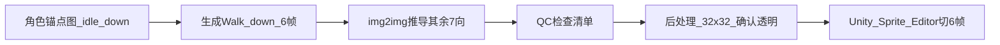

# 主角八向动作素材 — AI 生图提示词

Cute Fantasy 风格 chibi 主角，8 方向 × 6 帧 × 6 动作，透明背景 PNG。

**参考资源**：[`Player.png`](../material/Cute_Fantasy_Free/Player/Player.png)  
**当前代码**：4 向 + flipX（[`PlayerAnimation.cs`](../Scripts/Player/PlayerAnimation.cs)）；本文档面向完整 8 向素材生产。

---

## 规格摘要

| 项 | 值 |
|---|---|
| 单帧尺寸 | 32×32 px |
| 序列图尺寸 | 192×32 px（横向 6 帧） |
| PPU | 32，Point filter |
| 方向 | down / down_left / left / up_left / up / up_right / right / down_right |
| 动作 | Idle / Walk / Run / Dash / Attack / Death |
| 总量 | 48 张序列图（6 动作 × 8 方向） |
| 输出 | 透明背景 PNG（已抠图） |

---

## 1. 角色锚点（Character Anchor）

全提示词共用，保证跨动作、跨方向角色一致。

### 中文描述块（国内 AI 工具）

> 俯视 2D 像素 RPG 主角，chibi 比例（头身比约 1:1.5），少年男性冒险者。**棕色蓬松短发**（发梢略翘，侧分），**明亮琥珀色圆眼**（2px 高光点），**浅肤色**。上身穿 **草绿色无袖_tunic**（领口 V 形、腰部同色腰带），**蓝色及膝短裤**，**米色绑带短靴**（鞋头略圆）。无披风、无头盔、无武器（Attack 动作单独加短剑）。整体轮廓紧凑，四肢短粗，适合 32×32 小尺寸辨识。

### 英文关键词块（Midjourney / SD / Flux）

```text
top-down chibi pixel art RPG hero boy, messy brown hair with side-swept bangs, amber dot eyes with white highlight, light skin, sleeveless grass-green tunic with V-neck and belt, blue knee shorts, beige lace-up boots, compact silhouette, Cute Fantasy style, limited warm palette, no outline bleed
```

### 识别特征 QC 清单

生成后逐帧对照：

- [ ] **绿_tunic + 蓝裤 + 棕发** — 三色对比每帧可见
- [ ] 发顶 3~4 簇像素表现蓬松感
- [ ] 靴子米色块在帧底部居中
- [ ] 眼睛占脸部宽度约 40%（正面/斜面方向）
- [ ] 单帧严格 32×32，6 帧等宽排列
- [ ] 背景完全透明，无地面阴影、无白底
- [ ] 像素边缘清晰，无抗锯齿模糊
- [ ] 8 方向间发色、服装色一致

---

## 2. 技术规格（Technical Spec）

### 正向（每条提示词末尾追加）

```text
32x32 pixels per frame, pixel-perfect, crisp edges, no anti-aliasing, no blur, no gradient shading, flat cel-shaded pixels, horizontal sprite sheet 6 frames in one row (total 192x32), transparent background PNG, alpha channel cutout, isolated character only, no ground shadow, no props, no text, no watermark, consistent character design across all frames, game asset, Unity-ready sprite strip
```

### 负向（Negative Prompt）

```text
blurry, smooth, anti-aliased, realistic, 3D render, photograph, background, floor, shadow blob, gradient background, white background, extra limbs, deformed face, wrong colors, helmet, cape, armor, gun, modern clothing, isometric camera tilt, perspective distortion, frame size inconsistent, merged frames, grid lines
```

### 抠图强化句（支持 weight 的工具）

```text
(transparent background:1.4), (alpha cutout:1.3), (no background elements:1.2)
```

---

## 3. 八向朝向定义

角色面朝该方向移动或攻击（俯视时钟方向）：

| ID | 方向名 | 中文 | 身体朝向要点 |
|----|--------|------|-------------|
| D | down | 正下 | 正面朝向镜头，可见双眼与_tunic 领口 |
| DL | down_left | 左下 | 3/4 左前，左肩略大，右眼部分被鼻侧遮挡 |
| L | left | 正左 | 纯侧面，仅见一只眼，右臂前摆左臂后摆 |
| UL | up_left | 左上 | 3/4 左后，后脑与发顶可见增多 |
| U | up | 正上 | 背面，无面部，发顶 + _tunic 后背 + 腰带结 |
| UR | up_right | 右上 | 3/4 右后，与 UL 镜像 |
| R | right | 正右 | 纯右侧面，与 L 镜像 |
| DR | down_right | 右下 | 3/4 右前，与 DL 镜像 |

**一致性建议**：同一动作 8 方向使用同一 seed / reference；先生成 **down** 与 **right**，再 img2img 推导斜向。

---

## 4. 六帧动作分解

### Idle（待机）— 6 帧循环

| 帧 | 描述 |
|----|------|
| 1 | 站立中立，双脚并拢，双臂自然下垂 |
| 2 | 轻微吸气，胸口上提 1px，头发微翘 |
| 3 | 吸气顶点，肩膀最高 |
| 4 | 呼气开始，回落 |
| 5 | 呼气低点，略缩肩 |
| 6 | 回到帧 1 过渡位 |

动作句：`subtle idle breathing bob animation, 6-frame loop, minimal vertical movement 1-2 pixels`

### Walk（行走）— 6 帧循环

| 帧 | 描述 |
|----|------|
| 1 | 右脚前触地（contact），左臂前摆 |
| 2 | 重心过右脚（passing） |
| 3 | 左脚最高抬起（apex） |
| 4 | 左脚前触地，右臂前摆 |
| 5 | 重心过左脚 |
| 6 | 右脚抬起准备下一循环 |

动作句：`walk cycle, moderate stride, arms swing opposite to legs, 6-frame loop, casual adventure pace`

### Run（奔跑）— 6 帧循环

| 帧 | 描述 |
|----|------|
| 1 | 身体前倾 2px，右膝高抬 |
| 2 | 冲刺中段，头发向后飘 1~2px |
| 3 | 双脚短暂离地感（chibi 跳跃感） |
| 4 | 左膝高抬，前倾维持 |
| 5 | 落地缓冲，微蹲 |
| 6 | 推地加速，发梢抖动 |

动作句：`run cycle, forward lean, bouncy chibi motion, hair bounce, faster than walk, 6-frame loop`

### Dash（冲刺）— 6 帧单次/短循环

| 帧 | 描述 |
|----|------|
| 1 | 蓄力蹲伏，重心压低 |
| 2 | 爆发起步，身体水平压缩 |
| 3 | 高速滑行，残影可选（1px 重复轮廓） |
| 4 | 维持冲刺，腿几乎不可见（速度线） |
| 5 | 减速露头，脚重新可见 |
| 6 | 急停，小幅后倾 |

动作句：`dash burst animation, squash and stretch, optional 1px motion echo, 6 frames, high speed horizontal blur pixels only`

### Attack（攻击）— 6 帧单次

武器锚点：`small silver short sword, 8px blade, brown grip, held in front hand`

| 帧 | 描述 |
|----|------|
| 1 | 握剑待机，剑竖于身侧 |
| 2 | 后拉蓄力，剑举至肩后 |
| 3 | 挥砍中段，剑呈 45° 弧 |
| 4 | **命中帧**，剑尖最远，可加 1px 白色挥砍弧 |
| 5 | 收招，剑过身体 |
| 6 | 恢复站立，剑归位 |

动作句：`sword slash attack, single non-looping arc swing toward facing direction, impact frame 4, 6 frames`

### Death（死亡）— 6 帧非循环

| 帧 | 描述 |
|----|------|
| 1 | 受击后仰，眼睛变 > < 或 X |
| 2 | 膝弯下沉 |
| 3 | 侧倒/前倒 midpoint |
| 4 | 倒地，身体扁平化 |
| 5 | 颜色减饱和，加透明像素散点 |
| 6 | 几乎消失，仅余 2~3 像素残影 |

动作句：`death dissolve animation, non-looping, fade out with pixel scatter, frames 5-6 increasing transparency`

---

## 5. 完整提示词（48 条）

结构：`[角色锚点] + [方向] + [动作六帧] + [技术规格]`

负向统一使用第 2 节 Negative Prompt。

---

### 5.1 Idle — 8 方向

#### Idle / down

```text
top-down chibi pixel art RPG hero boy, messy brown hair with side-swept bangs, amber dot eyes with white highlight, light skin, sleeveless grass-green tunic with V-neck and belt, blue knee shorts, beige lace-up boots, compact silhouette, Cute Fantasy style, facing south front view toward camera both eyes visible green tunic V-neck, subtle idle breathing bob animation 6-frame horizontal sprite sheet loop, frame1 neutral stand feet together arms down, frame2 slight inhale chest up 1px hair lift, frame3 inhale peak shoulders highest, frame4 exhale begin settling, frame5 exhale low slight shoulder drop, frame6 transition back to neutral, 32x32 pixels per frame pixel-perfect crisp edges no anti-aliasing horizontal sprite sheet 6 frames in one row total 192x32 transparent background PNG alpha cutout isolated character only no ground shadow game asset Unity-ready sprite strip
```

#### Idle / down_left

```text
top-down chibi pixel art RPG hero boy, messy brown hair with side-swept bangs, amber dot eyes with white highlight, light skin, sleeveless grass-green tunic with V-neck and belt, blue knee shorts, beige lace-up boots, compact silhouette, Cute Fantasy style, facing southwest 3/4 left front view left shoulder larger right eye partially hidden, subtle idle breathing bob animation 6-frame horizontal sprite sheet loop, frame1 neutral stand feet together arms down, frame2 slight inhale chest up 1px hair lift, frame3 inhale peak shoulders highest, frame4 exhale begin settling, frame5 exhale low slight shoulder drop, frame6 transition back to neutral, 32x32 pixels per frame pixel-perfect crisp edges no anti-aliasing horizontal sprite sheet 6 frames in one row total 192x32 transparent background PNG alpha cutout isolated character only no ground shadow game asset Unity-ready sprite strip
```

#### Idle / left

```text
top-down chibi pixel art RPG hero boy, messy brown hair with side-swept bangs, amber dot eyes with white highlight, light skin, sleeveless grass-green tunic with V-neck and belt, blue knee shorts, beige lace-up boots, compact silhouette, Cute Fantasy style, facing west pure left side profile one eye visible, subtle idle breathing bob animation 6-frame horizontal sprite sheet loop, frame1 neutral stand feet together arms down, frame2 slight inhale chest up 1px hair lift, frame3 inhale peak shoulders highest, frame4 exhale begin settling, frame5 exhale low slight shoulder drop, frame6 transition back to neutral, 32x32 pixels per frame pixel-perfect crisp edges no anti-aliasing horizontal sprite sheet 6 frames in one row total 192x32 transparent background PNG alpha cutout isolated character only no ground shadow game asset Unity-ready sprite strip
```

#### Idle / up_left

```text
top-down chibi pixel art RPG hero boy, messy brown hair with side-swept bangs, light skin, sleeveless grass-green tunic with belt, blue knee shorts, beige lace-up boots, compact silhouette, Cute Fantasy style, facing northwest 3/4 left back view back of head and hair top visible no face, subtle idle breathing bob animation 6-frame horizontal sprite sheet loop, frame1 neutral stand feet together arms down, frame2 slight inhale chest up 1px hair lift, frame3 inhale peak shoulders highest, frame4 exhale begin settling, frame5 exhale low slight shoulder drop, frame6 transition back to neutral, 32x32 pixels per frame pixel-perfect crisp edges no anti-aliasing horizontal sprite sheet 6 frames in one row total 192x32 transparent background PNG alpha cutout isolated character only no ground shadow game asset Unity-ready sprite strip
```

#### Idle / up

```text
top-down chibi pixel art RPG hero boy, messy brown hair with side-swept bangs, light skin, sleeveless grass-green tunic with belt knot on back, blue knee shorts, beige lace-up boots, compact silhouette, Cute Fantasy style, facing north back view no face brown hair top green tunic back belt knot visible, subtle idle breathing bob animation 6-frame horizontal sprite sheet loop, frame1 neutral stand feet together arms down, frame2 slight inhale chest up 1px hair lift, frame3 inhale peak shoulders highest, frame4 exhale begin settling, frame5 exhale low slight shoulder drop, frame6 transition back to neutral, 32x32 pixels per frame pixel-perfect crisp edges no anti-aliasing horizontal sprite sheet 6 frames in one row total 192x32 transparent background PNG alpha cutout isolated character only no ground shadow game asset Unity-ready sprite strip
```

#### Idle / up_right

```text
top-down chibi pixel art RPG hero boy, messy brown hair with side-swept bangs, light skin, sleeveless grass-green tunic with belt, blue knee shorts, beige lace-up boots, compact silhouette, Cute Fantasy style, facing northeast 3/4 right back view back of head and hair top visible no face mirror of up_left, subtle idle breathing bob animation 6-frame horizontal sprite sheet loop, frame1 neutral stand feet together arms down, frame2 slight inhale chest up 1px hair lift, frame3 inhale peak shoulders highest, frame4 exhale begin settling, frame5 exhale low slight shoulder drop, frame6 transition back to neutral, 32x32 pixels per frame pixel-perfect crisp edges no anti-aliasing horizontal sprite sheet 6 frames in one row total 192x32 transparent background PNG alpha cutout isolated character only no ground shadow game asset Unity-ready sprite strip
```

#### Idle / right

```text
top-down chibi pixel art RPG hero boy, messy brown hair with side-swept bangs, amber dot eyes with white highlight, light skin, sleeveless grass-green tunic with V-neck and belt, blue knee shorts, beige lace-up boots, compact silhouette, Cute Fantasy style, facing east pure right side profile one eye visible mirror of left, subtle idle breathing bob animation 6-frame horizontal sprite sheet loop, frame1 neutral stand feet together arms down, frame2 slight inhale chest up 1px hair lift, frame3 inhale peak shoulders highest, frame4 exhale begin settling, frame5 exhale low slight shoulder drop, frame6 transition back to neutral, 32x32 pixels per frame pixel-perfect crisp edges no anti-aliasing horizontal sprite sheet 6 frames in one row total 192x32 transparent background PNG alpha cutout isolated character only no ground shadow game asset Unity-ready sprite strip
```

#### Idle / down_right

```text
top-down chibi pixel art RPG hero boy, messy brown hair with side-swept bangs, amber dot eyes with white highlight, light skin, sleeveless grass-green tunic with V-neck and belt, blue knee shorts, beige lace-up boots, compact silhouette, Cute Fantasy style, facing southeast 3/4 right front view right shoulder larger left eye partially hidden mirror of down_left, subtle idle breathing bob animation 6-frame horizontal sprite sheet loop, frame1 neutral stand feet together arms down, frame2 slight inhale chest up 1px hair lift, frame3 inhale peak shoulders highest, frame4 exhale begin settling, frame5 exhale low slight shoulder drop, frame6 transition back to neutral, 32x32 pixels per frame pixel-perfect crisp edges no anti-aliasing horizontal sprite sheet 6 frames in one row total 192x32 transparent background PNG alpha cutout isolated character only no ground shadow game asset Unity-ready sprite strip
```

---

### 5.2 Walk — 8 方向

#### Walk / down

```text
top-down chibi pixel art RPG hero boy, messy brown hair with side-swept bangs, amber dot eyes with white highlight, light skin, sleeveless grass-green tunic with V-neck and belt, blue knee shorts, beige lace-up boots, compact silhouette, Cute Fantasy style, facing south walking toward camera front view, walk cycle moderate stride arms swing opposite to legs 6-frame horizontal sprite sheet loop, frame1 right foot forward contact left arm forward, frame2 passing pose weight over right foot, frame3 left foot raised apex highest, frame4 left foot forward contact right arm forward, frame5 passing pose weight over left foot, frame6 right foot raised preparing next cycle, 32x32 pixels per frame pixel-perfect crisp edges no anti-aliasing horizontal sprite sheet 6 frames in one row total 192x32 transparent background PNG alpha cutout isolated character only no ground shadow game asset Unity-ready sprite strip
```

#### Walk / down_left

```text
top-down chibi pixel art RPG hero boy, messy brown hair with side-swept bangs, amber dot eyes with white highlight, light skin, sleeveless grass-green tunic with V-neck and belt, blue knee shorts, beige lace-up boots, compact silhouette, Cute Fantasy style, facing southwest walking 3/4 left front view, walk cycle moderate stride arms swing opposite to legs 6-frame horizontal sprite sheet loop, frame1 right foot forward contact left arm forward, frame2 passing pose weight over right foot, frame3 left foot raised apex highest, frame4 left foot forward contact right arm forward, frame5 passing pose weight over left foot, frame6 right foot raised preparing next cycle, 32x32 pixels per frame pixel-perfect crisp edges no anti-aliasing horizontal sprite sheet 6 frames in one row total 192x32 transparent background PNG alpha cutout isolated character only no ground shadow game asset Unity-ready sprite strip
```

#### Walk / left

```text
top-down chibi pixel art RPG hero boy, messy brown hair with side-swept bangs, amber dot eyes with white highlight, light skin, sleeveless grass-green tunic with V-neck and belt, blue knee shorts, beige lace-up boots, compact silhouette, Cute Fantasy style, facing west walking left side profile one eye visible, walk cycle moderate stride arms swing opposite to legs 6-frame horizontal sprite sheet loop, frame1 right foot forward contact left arm forward, frame2 passing pose weight over right foot, frame3 left foot raised apex highest, frame4 left foot forward contact right arm forward, frame5 passing pose weight over left foot, frame6 right foot raised preparing next cycle, 32x32 pixels per frame pixel-perfect crisp edges no anti-aliasing horizontal sprite sheet 6 frames in one row total 192x32 transparent background PNG alpha cutout isolated character only no ground shadow game asset Unity-ready sprite strip
```

#### Walk / up_left

```text
top-down chibi pixel art RPG hero boy, messy brown hair with side-swept bangs, light skin, sleeveless grass-green tunic with belt, blue knee shorts, beige lace-up boots, compact silhouette, Cute Fantasy style, facing northwest walking 3/4 left back view hair top visible no face, walk cycle moderate stride arms swing opposite to legs 6-frame horizontal sprite sheet loop, frame1 right foot forward contact left arm forward, frame2 passing pose weight over right foot, frame3 left foot raised apex highest, frame4 left foot forward contact right arm forward, frame5 passing pose weight over left foot, frame6 right foot raised preparing next cycle, 32x32 pixels per frame pixel-perfect crisp edges no anti-aliasing horizontal sprite sheet 6 frames in one row total 192x32 transparent background PNG alpha cutout isolated character only no ground shadow game asset Unity-ready sprite strip
```

#### Walk / up

```text
top-down chibi pixel art RPG hero boy, messy brown hair with side-swept bangs, light skin, sleeveless grass-green tunic with belt knot on back, blue knee shorts, beige lace-up boots, compact silhouette, Cute Fantasy style, facing north walking back view no face brown hair top green tunic back, walk cycle moderate stride arms swing opposite to legs 6-frame horizontal sprite sheet loop, frame1 right foot forward contact left arm forward, frame2 passing pose weight over right foot, frame3 left foot raised apex highest, frame4 left foot forward contact right arm forward, frame5 passing pose weight over left foot, frame6 right foot raised preparing next cycle, 32x32 pixels per frame pixel-perfect crisp edges no anti-aliasing horizontal sprite sheet 6 frames in one row total 192x32 transparent background PNG alpha cutout isolated character only no ground shadow game asset Unity-ready sprite strip
```

#### Walk / up_right

```text
top-down chibi pixel art RPG hero boy, messy brown hair with side-swept bangs, light skin, sleeveless grass-green tunic with belt, blue knee shorts, beige lace-up boots, compact silhouette, Cute Fantasy style, facing northeast walking 3/4 right back view hair top visible no face, walk cycle moderate stride arms swing opposite to legs 6-frame horizontal sprite sheet loop, frame1 right foot forward contact left arm forward, frame2 passing pose weight over right foot, frame3 left foot raised apex highest, frame4 left foot forward contact right arm forward, frame5 passing pose weight over left foot, frame6 right foot raised preparing next cycle, 32x32 pixels per frame pixel-perfect crisp edges no anti-aliasing horizontal sprite sheet 6 frames in one row total 192x32 transparent background PNG alpha cutout isolated character only no ground shadow game asset Unity-ready sprite strip
```

#### Walk / right

```text
top-down chibi pixel art RPG hero boy, messy brown hair with side-swept bangs, amber dot eyes with white highlight, light skin, sleeveless grass-green tunic with V-neck and belt, blue knee shorts, beige lace-up boots, compact silhouette, Cute Fantasy style, facing east walking right side profile one eye visible, walk cycle moderate stride arms swing opposite to legs 6-frame horizontal sprite sheet loop, frame1 right foot forward contact left arm forward, frame2 passing pose weight over right foot, frame3 left foot raised apex highest, frame4 left foot forward contact right arm forward, frame5 passing pose weight over left foot, frame6 right foot raised preparing next cycle, 32x32 pixels per frame pixel-perfect crisp edges no anti-aliasing horizontal sprite sheet 6 frames in one row total 192x32 transparent background PNG alpha cutout isolated character only no ground shadow game asset Unity-ready sprite strip
```

#### Walk / down_right

```text
top-down chibi pixel art RPG hero boy, messy brown hair with side-swept bangs, amber dot eyes with white highlight, light skin, sleeveless grass-green tunic with V-neck and belt, blue knee shorts, beige lace-up boots, compact silhouette, Cute Fantasy style, facing southeast walking 3/4 right front view, walk cycle moderate stride arms swing opposite to legs 6-frame horizontal sprite sheet loop, frame1 right foot forward contact left arm forward, frame2 passing pose weight over right foot, frame3 left foot raised apex highest, frame4 left foot forward contact right arm forward, frame5 passing pose weight over left foot, frame6 right foot raised preparing next cycle, 32x32 pixels per frame pixel-perfect crisp edges no anti-aliasing horizontal sprite sheet 6 frames in one row total 192x32 transparent background PNG alpha cutout isolated character only no ground shadow game asset Unity-ready sprite strip
```

---

### 5.3 Run — 8 方向

#### Run / down

```text
top-down chibi pixel art RPG hero boy, messy brown hair with side-swept bangs, amber dot eyes with white highlight, light skin, sleeveless grass-green tunic with V-neck and belt, blue knee shorts, beige lace-up boots, compact silhouette, Cute Fantasy style, facing south running toward camera front view, run cycle forward lean bouncy chibi motion hair bounce faster than walk 6-frame horizontal sprite sheet loop, frame1 body lean forward 2px right knee high raised, frame2 mid sprint hair blown back 1-2px, frame3 both feet briefly off ground chibi hop feel, frame4 left knee high raised lean maintained, frame5 landing buffer slight crouch, frame6 push off acceleration hair tips shake, 32x32 pixels per frame pixel-perfect crisp edges no anti-aliasing horizontal sprite sheet 6 frames in one row total 192x32 transparent background PNG alpha cutout isolated character only no ground shadow game asset Unity-ready sprite strip
```

#### Run / down_left

```text
top-down chibi pixel art RPG hero boy, messy brown hair with side-swept bangs, amber dot eyes with white highlight, light skin, sleeveless grass-green tunic with V-neck and belt, blue knee shorts, beige lace-up boots, compact silhouette, Cute Fantasy style, facing southwest running 3/4 left front view, run cycle forward lean bouncy chibi motion hair bounce faster than walk 6-frame horizontal sprite sheet loop, frame1 body lean forward 2px right knee high raised, frame2 mid sprint hair blown back 1-2px, frame3 both feet briefly off ground chibi hop feel, frame4 left knee high raised lean maintained, frame5 landing buffer slight crouch, frame6 push off acceleration hair tips shake, 32x32 pixels per frame pixel-perfect crisp edges no anti-aliasing horizontal sprite sheet 6 frames in one row total 192x32 transparent background PNG alpha cutout isolated character only no ground shadow game asset Unity-ready sprite strip
```

#### Run / left

```text
top-down chibi pixel art RPG hero boy, messy brown hair with side-swept bangs, amber dot eyes with white highlight, light skin, sleeveless grass-green tunic with V-neck and belt, blue knee shorts, beige lace-up boots, compact silhouette, Cute Fantasy style, facing west running left side profile one eye visible, run cycle forward lean bouncy chibi motion hair bounce faster than walk 6-frame horizontal sprite sheet loop, frame1 body lean forward 2px right knee high raised, frame2 mid sprint hair blown back 1-2px, frame3 both feet briefly off ground chibi hop feel, frame4 left knee high raised lean maintained, frame5 landing buffer slight crouch, frame6 push off acceleration hair tips shake, 32x32 pixels per frame pixel-perfect crisp edges no anti-aliasing horizontal sprite sheet 6 frames in one row total 192x32 transparent background PNG alpha cutout isolated character only no ground shadow game asset Unity-ready sprite strip
```

#### Run / up_left

```text
top-down chibi pixel art RPG hero boy, messy brown hair with side-swept bangs, light skin, sleeveless grass-green tunic with belt, blue knee shorts, beige lace-up boots, compact silhouette, Cute Fantasy style, facing northwest running 3/4 left back view hair top visible no face, run cycle forward lean bouncy chibi motion hair bounce faster than walk 6-frame horizontal sprite sheet loop, frame1 body lean forward 2px right knee high raised, frame2 mid sprint hair blown back 1-2px, frame3 both feet briefly off ground chibi hop feel, frame4 left knee high raised lean maintained, frame5 landing buffer slight crouch, frame6 push off acceleration hair tips shake, 32x32 pixels per frame pixel-perfect crisp edges no anti-aliasing horizontal sprite sheet 6 frames in one row total 192x32 transparent background PNG alpha cutout isolated character only no ground shadow game asset Unity-ready sprite strip
```

#### Run / up

```text
top-down chibi pixel art RPG hero boy, messy brown hair with side-swept bangs, light skin, sleeveless grass-green tunic with belt knot on back, blue knee shorts, beige lace-up boots, compact silhouette, Cute Fantasy style, facing north running back view no face brown hair top green tunic back, run cycle forward lean bouncy chibi motion hair bounce faster than walk 6-frame horizontal sprite sheet loop, frame1 body lean forward 2px right knee high raised, frame2 mid sprint hair blown back 1-2px, frame3 both feet briefly off ground chibi hop feel, frame4 left knee high raised lean maintained, frame5 landing buffer slight crouch, frame6 push off acceleration hair tips shake, 32x32 pixels per frame pixel-perfect crisp edges no anti-aliasing horizontal sprite sheet 6 frames in one row total 192x32 transparent background PNG alpha cutout isolated character only no ground shadow game asset Unity-ready sprite strip
```

#### Run / up_right

```text
top-down chibi pixel art RPG hero boy, messy brown hair with side-swept bangs, light skin, sleeveless grass-green tunic with belt, blue knee shorts, beige lace-up boots, compact silhouette, Cute Fantasy style, facing northeast running 3/4 right back view hair top visible no face, run cycle forward lean bouncy chibi motion hair bounce faster than walk 6-frame horizontal sprite sheet loop, frame1 body lean forward 2px right knee high raised, frame2 mid sprint hair blown back 1-2px, frame3 both feet briefly off ground chibi hop feel, frame4 left knee high raised lean maintained, frame5 landing buffer slight crouch, frame6 push off acceleration hair tips shake, 32x32 pixels per frame pixel-perfect crisp edges no anti-aliasing horizontal sprite sheet 6 frames in one row total 192x32 transparent background PNG alpha cutout isolated character only no ground shadow game asset Unity-ready sprite strip
```

#### Run / right

```text
top-down chibi pixel art RPG hero boy, messy brown hair with side-swept bangs, amber dot eyes with white highlight, light skin, sleeveless grass-green tunic with V-neck and belt, blue knee shorts, beige lace-up boots, compact silhouette, Cute Fantasy style, facing east running right side profile one eye visible, run cycle forward lean bouncy chibi motion hair bounce faster than walk 6-frame horizontal sprite sheet loop, frame1 body lean forward 2px right knee high raised, frame2 mid sprint hair blown back 1-2px, frame3 both feet briefly off ground chibi hop feel, frame4 left knee high raised lean maintained, frame5 landing buffer slight crouch, frame6 push off acceleration hair tips shake, 32x32 pixels per frame pixel-perfect crisp edges no anti-aliasing horizontal sprite sheet 6 frames in one row total 192x32 transparent background PNG alpha cutout isolated character only no ground shadow game asset Unity-ready sprite strip
```

#### Run / down_right

```text
top-down chibi pixel art RPG hero boy, messy brown hair with side-swept bangs, amber dot eyes with white highlight, light skin, sleeveless grass-green tunic with V-neck and belt, blue knee shorts, beige lace-up boots, compact silhouette, Cute Fantasy style, facing southeast running 3/4 right front view, run cycle forward lean bouncy chibi motion hair bounce faster than walk 6-frame horizontal sprite sheet loop, frame1 body lean forward 2px right knee high raised, frame2 mid sprint hair blown back 1-2px, frame3 both feet briefly off ground chibi hop feel, frame4 left knee high raised lean maintained, frame5 landing buffer slight crouch, frame6 push off acceleration hair tips shake, 32x32 pixels per frame pixel-perfect crisp edges no anti-aliasing horizontal sprite sheet 6 frames in one row total 192x32 transparent background PNG alpha cutout isolated character only no ground shadow game asset Unity-ready sprite strip
```

---

### 5.4 Dash — 8 方向

#### Dash / down

```text
top-down chibi pixel art RPG hero boy, messy brown hair with side-swept bangs, amber dot eyes with white highlight, light skin, sleeveless grass-green tunic with V-neck and belt, blue knee shorts, beige lace-up boots, compact silhouette, Cute Fantasy style, facing south dashing toward camera front view, dash burst animation squash and stretch optional 1px motion echo 6-frame horizontal sprite sheet, frame1 crouch wind-up low center of gravity, frame2 burst start horizontal body compression, frame3 high speed slide optional 1px duplicate outline ghost, frame4 sustained dash legs nearly invisible speed lines pixels only, frame5 deceleration head and feet reappear, frame6 hard stop slight backward lean, 32x32 pixels per frame pixel-perfect crisp edges no anti-aliasing horizontal sprite sheet 6 frames in one row total 192x32 transparent background PNG alpha cutout isolated character only no ground shadow game asset Unity-ready sprite strip
```

#### Dash / down_left

```text
top-down chibi pixel art RPG hero boy, messy brown hair with side-swept bangs, amber dot eyes with white highlight, light skin, sleeveless grass-green tunic with V-neck and belt, blue knee shorts, beige lace-up boots, compact silhouette, Cute Fantasy style, facing southwest dashing 3/4 left front view, dash burst animation squash and stretch optional 1px motion echo 6-frame horizontal sprite sheet, frame1 crouch wind-up low center of gravity, frame2 burst start horizontal body compression, frame3 high speed slide optional 1px duplicate outline ghost, frame4 sustained dash legs nearly invisible speed lines pixels only, frame5 deceleration head and feet reappear, frame6 hard stop slight backward lean, 32x32 pixels per frame pixel-perfect crisp edges no anti-aliasing horizontal sprite sheet 6 frames in one row total 192x32 transparent background PNG alpha cutout isolated character only no ground shadow game asset Unity-ready sprite strip
```

#### Dash / left

```text
top-down chibi pixel art RPG hero boy, messy brown hair with side-swept bangs, amber dot eyes with white highlight, light skin, sleeveless grass-green tunic with V-neck and belt, blue knee shorts, beige lace-up boots, compact silhouette, Cute Fantasy style, facing west dashing left side profile one eye visible, dash burst animation squash and stretch optional 1px motion echo 6-frame horizontal sprite sheet, frame1 crouch wind-up low center of gravity, frame2 burst start horizontal body compression, frame3 high speed slide optional 1px duplicate outline ghost, frame4 sustained dash legs nearly invisible speed lines pixels only, frame5 deceleration head and feet reappear, frame6 hard stop slight backward lean, 32x32 pixels per frame pixel-perfect crisp edges no anti-aliasing horizontal sprite sheet 6 frames in one row total 192x32 transparent background PNG alpha cutout isolated character only no ground shadow game asset Unity-ready sprite strip
```

#### Dash / up_left

```text
top-down chibi pixel art RPG hero boy, messy brown hair with side-swept bangs, light skin, sleeveless grass-green tunic with belt, blue knee shorts, beige lace-up boots, compact silhouette, Cute Fantasy style, facing northwest dashing 3/4 left back view hair top visible no face, dash burst animation squash and stretch optional 1px motion echo 6-frame horizontal sprite sheet, frame1 crouch wind-up low center of gravity, frame2 burst start horizontal body compression, frame3 high speed slide optional 1px duplicate outline ghost, frame4 sustained dash legs nearly invisible speed lines pixels only, frame5 deceleration head and feet reappear, frame6 hard stop slight backward lean, 32x32 pixels per frame pixel-perfect crisp edges no anti-aliasing horizontal sprite sheet 6 frames in one row total 192x32 transparent background PNG alpha cutout isolated character only no ground shadow game asset Unity-ready sprite strip
```

#### Dash / up

```text
top-down chibi pixel art RPG hero boy, messy brown hair with side-swept bangs, light skin, sleeveless grass-green tunic with belt knot on back, blue knee shorts, beige lace-up boots, compact silhouette, Cute Fantasy style, facing north dashing back view no face brown hair top green tunic back, dash burst animation squash and stretch optional 1px motion echo 6-frame horizontal sprite sheet, frame1 crouch wind-up low center of gravity, frame2 burst start horizontal body compression, frame3 high speed slide optional 1px duplicate outline ghost, frame4 sustained dash legs nearly invisible speed lines pixels only, frame5 deceleration head and feet reappear, frame6 hard stop slight backward lean, 32x32 pixels per frame pixel-perfect crisp edges no anti-aliasing horizontal sprite sheet 6 frames in one row total 192x32 transparent background PNG alpha cutout isolated character only no ground shadow game asset Unity-ready sprite strip
```

#### Dash / up_right

```text
top-down chibi pixel art RPG hero boy, messy brown hair with side-swept bangs, light skin, sleeveless grass-green tunic with belt, blue knee shorts, beige lace-up boots, compact silhouette, Cute Fantasy style, facing northeast dashing 3/4 right back view hair top visible no face, dash burst animation squash and stretch optional 1px motion echo 6-frame horizontal sprite sheet, frame1 crouch wind-up low center of gravity, frame2 burst start horizontal body compression, frame3 high speed slide optional 1px duplicate outline ghost, frame4 sustained dash legs nearly invisible speed lines pixels only, frame5 deceleration head and feet reappear, frame6 hard stop slight backward lean, 32x32 pixels per frame pixel-perfect crisp edges no anti-aliasing horizontal sprite sheet 6 frames in one row total 192x32 transparent background PNG alpha cutout isolated character only no ground shadow game asset Unity-ready sprite strip
```

#### Dash / right

```text
top-down chibi pixel art RPG hero boy, messy brown hair with side-swept bangs, amber dot eyes with white highlight, light skin, sleeveless grass-green tunic with V-neck and belt, blue knee shorts, beige lace-up boots, compact silhouette, Cute Fantasy style, facing east dashing right side profile one eye visible, dash burst animation squash and stretch optional 1px motion echo 6-frame horizontal sprite sheet, frame1 crouch wind-up low center of gravity, frame2 burst start horizontal body compression, frame3 high speed slide optional 1px duplicate outline ghost, frame4 sustained dash legs nearly invisible speed lines pixels only, frame5 deceleration head and feet reappear, frame6 hard stop slight backward lean, 32x32 pixels per frame pixel-perfect crisp edges no anti-aliasing horizontal sprite sheet 6 frames in one row total 192x32 transparent background PNG alpha cutout isolated character only no ground shadow game asset Unity-ready sprite strip
```

#### Dash / down_right

```text
top-down chibi pixel art RPG hero boy, messy brown hair with side-swept bangs, amber dot eyes with white highlight, light skin, sleeveless grass-green tunic with V-neck and belt, blue knee shorts, beige lace-up boots, compact silhouette, Cute Fantasy style, facing southeast dashing 3/4 right front view, dash burst animation squash and stretch optional 1px motion echo 6-frame horizontal sprite sheet, frame1 crouch wind-up low center of gravity, frame2 burst start horizontal body compression, frame3 high speed slide optional 1px duplicate outline ghost, frame4 sustained dash legs nearly invisible speed lines pixels only, frame5 deceleration head and feet reappear, frame6 hard stop slight backward lean, 32x32 pixels per frame pixel-perfect crisp edges no anti-aliasing horizontal sprite sheet 6 frames in one row total 192x32 transparent background PNG alpha cutout isolated character only no ground shadow game asset Unity-ready sprite strip
```

---

### 5.5 Attack — 8 方向

#### Attack / down

```text
top-down chibi pixel art RPG hero boy, messy brown hair with side-swept bangs, amber dot eyes with white highlight, light skin, sleeveless grass-green tunic with V-neck and belt, blue knee shorts, beige lace-up boots, compact silhouette, Cute Fantasy style, facing south front view toward camera, small silver short sword 8px blade brown grip held in front hand, sword slash attack single non-looping arc swing toward facing direction 6-frame horizontal sprite sheet impact frame 4, frame1 sword held at side vertical ready stance, frame2 wind-up sword pulled behind shoulder, frame3 mid slash sword at 45 degree arc, frame4 impact frame sword tip farthest optional 1px white slash arc pixel, frame5 follow-through sword passing body, frame6 recovery standing sword returned to side, 32x32 pixels per frame pixel-perfect crisp edges no anti-aliasing horizontal sprite sheet 6 frames in one row total 192x32 transparent background PNG alpha cutout isolated character only no ground shadow game asset Unity-ready sprite strip
```

#### Attack / down_left

```text
top-down chibi pixel art RPG hero boy, messy brown hair with side-swept bangs, amber dot eyes with white highlight, light skin, sleeveless grass-green tunic with V-neck and belt, blue knee shorts, beige lace-up boots, compact silhouette, Cute Fantasy style, facing southwest 3/4 left front view, small silver short sword 8px blade brown grip held in front hand, sword slash attack single non-looping arc swing toward facing direction 6-frame horizontal sprite sheet impact frame 4, frame1 sword held at side vertical ready stance, frame2 wind-up sword pulled behind shoulder, frame3 mid slash sword at 45 degree arc, frame4 impact frame sword tip farthest optional 1px white slash arc pixel, frame5 follow-through sword passing body, frame6 recovery standing sword returned to side, 32x32 pixels per frame pixel-perfect crisp edges no anti-aliasing horizontal sprite sheet 6 frames in one row total 192x32 transparent background PNG alpha cutout isolated character only no ground shadow game asset Unity-ready sprite strip
```

#### Attack / left

```text
top-down chibi pixel art RPG hero boy, messy brown hair with side-swept bangs, amber dot eyes with white highlight, light skin, sleeveless grass-green tunic with V-neck and belt, blue knee shorts, beige lace-up boots, compact silhouette, Cute Fantasy style, facing west left side profile one eye visible, small silver short sword 8px blade brown grip held in front hand, sword slash attack single non-looping arc swing toward facing direction 6-frame horizontal sprite sheet impact frame 4, frame1 sword held at side vertical ready stance, frame2 wind-up sword pulled behind shoulder, frame3 mid slash sword at 45 degree arc, frame4 impact frame sword tip farthest optional 1px white slash arc pixel, frame5 follow-through sword passing body, frame6 recovery standing sword returned to side, 32x32 pixels per frame pixel-perfect crisp edges no anti-aliasing horizontal sprite sheet 6 frames in one row total 192x32 transparent background PNG alpha cutout isolated character only no ground shadow game asset Unity-ready sprite strip
```

#### Attack / up_left

```text
top-down chibi pixel art RPG hero boy, messy brown hair with side-swept bangs, light skin, sleeveless grass-green tunic with belt, blue knee shorts, beige lace-up boots, compact silhouette, Cute Fantasy style, facing northwest 3/4 left back view hair top visible no face, small silver short sword 8px blade brown grip held in front hand, sword slash attack single non-looping arc swing toward facing direction 6-frame horizontal sprite sheet impact frame 4, frame1 sword held at side vertical ready stance, frame2 wind-up sword pulled behind shoulder, frame3 mid slash sword at 45 degree arc, frame4 impact frame sword tip farthest optional 1px white slash arc pixel, frame5 follow-through sword passing body, frame6 recovery standing sword returned to side, 32x32 pixels per frame pixel-perfect crisp edges no anti-aliasing horizontal sprite sheet 6 frames in one row total 192x32 transparent background PNG alpha cutout isolated character only no ground shadow game asset Unity-ready sprite strip
```

#### Attack / up

```text
top-down chibi pixel art RPG hero boy, messy brown hair with side-swept bangs, light skin, sleeveless grass-green tunic with belt knot on back, blue knee shorts, beige lace-up boots, compact silhouette, Cute Fantasy style, facing north back view no face brown hair top green tunic back, small silver short sword 8px blade brown grip held in front hand, sword slash attack single non-looping arc swing toward facing direction 6-frame horizontal sprite sheet impact frame 4, frame1 sword held at side vertical ready stance, frame2 wind-up sword pulled behind shoulder, frame3 mid slash sword at 45 degree arc, frame4 impact frame sword tip farthest optional 1px white slash arc pixel, frame5 follow-through sword passing body, frame6 recovery standing sword returned to side, 32x32 pixels per frame pixel-perfect crisp edges no anti-aliasing horizontal sprite sheet 6 frames in one row total 192x32 transparent background PNG alpha cutout isolated character only no ground shadow game asset Unity-ready sprite strip
```

#### Attack / up_right

```text
top-down chibi pixel art RPG hero boy, messy brown hair with side-swept bangs, light skin, sleeveless grass-green tunic with belt, blue knee shorts, beige lace-up boots, compact silhouette, Cute Fantasy style, facing northeast 3/4 right back view hair top visible no face, small silver short sword 8px blade brown grip held in front hand, sword slash attack single non-looping arc swing toward facing direction 6-frame horizontal sprite sheet impact frame 4, frame1 sword held at side vertical ready stance, frame2 wind-up sword pulled behind shoulder, frame3 mid slash sword at 45 degree arc, frame4 impact frame sword tip farthest optional 1px white slash arc pixel, frame5 follow-through sword passing body, frame6 recovery standing sword returned to side, 32x32 pixels per frame pixel-perfect crisp edges no anti-aliasing horizontal sprite sheet 6 frames in one row total 192x32 transparent background PNG alpha cutout isolated character only no ground shadow game asset Unity-ready sprite strip
```

#### Attack / right

```text
top-down chibi pixel art RPG hero boy, messy brown hair with side-swept bangs, amber dot eyes with white highlight, light skin, sleeveless grass-green tunic with V-neck and belt, blue knee shorts, beige lace-up boots, compact silhouette, Cute Fantasy style, facing east right side profile one eye visible, small silver short sword 8px blade brown grip held in front hand, sword slash attack single non-looping arc swing toward facing direction 6-frame horizontal sprite sheet impact frame 4, frame1 sword held at side vertical ready stance, frame2 wind-up sword pulled behind shoulder, frame3 mid slash sword at 45 degree arc, frame4 impact frame sword tip farthest optional 1px white slash arc pixel, frame5 follow-through sword passing body, frame6 recovery standing sword returned to side, 32x32 pixels per frame pixel-perfect crisp edges no anti-aliasing horizontal sprite sheet 6 frames in one row total 192x32 transparent background PNG alpha cutout isolated character only no ground shadow game asset Unity-ready sprite strip
```

#### Attack / down_right

```text
top-down chibi pixel art RPG hero boy, messy brown hair with side-swept bangs, amber dot eyes with white highlight, light skin, sleeveless grass-green tunic with V-neck and belt, blue knee shorts, beige lace-up boots, compact silhouette, Cute Fantasy style, facing southeast 3/4 right front view, small silver short sword 8px blade brown grip held in front hand, sword slash attack single non-looping arc swing toward facing direction 6-frame horizontal sprite sheet impact frame 4, frame1 sword held at side vertical ready stance, frame2 wind-up sword pulled behind shoulder, frame3 mid slash sword at 45 degree arc, frame4 impact frame sword tip farthest optional 1px white slash arc pixel, frame5 follow-through sword passing body, frame6 recovery standing sword returned to side, 32x32 pixels per frame pixel-perfect crisp edges no anti-aliasing horizontal sprite sheet 6 frames in one row total 192x32 transparent background PNG alpha cutout isolated character only no ground shadow game asset Unity-ready sprite strip
```

---

### 5.6 Death — 8 方向

#### Death / down

```text
top-down chibi pixel art RPG hero boy, messy brown hair with side-swept bangs, amber dot eyes with white highlight, light skin, sleeveless grass-green tunic with V-neck and belt, blue knee shorts, beige lace-up boots, compact silhouette, Cute Fantasy style, facing south front view toward camera, death dissolve animation non-looping fade out with pixel scatter 6-frame horizontal sprite sheet frames 5-6 increasing transparency, frame1 hit recoil leaning back eyes become X or greater-less-than, frame2 knees buckle sinking down, frame3 falling midpoint tipping sideways or forward, frame4 collapsed on ground body flattened, frame5 desaturated colors transparent pixel scatter begins, frame6 nearly vanished only 2-3 pixel remnant ghost, 32x32 pixels per frame pixel-perfect crisp edges no anti-aliasing horizontal sprite sheet 6 frames in one row total 192x32 transparent background PNG alpha cutout isolated character only no ground shadow game asset Unity-ready sprite strip
```

#### Death / down_left

```text
top-down chibi pixel art RPG hero boy, messy brown hair with side-swept bangs, amber dot eyes with white highlight, light skin, sleeveless grass-green tunic with V-neck and belt, blue knee shorts, beige lace-up boots, compact silhouette, Cute Fantasy style, facing southwest 3/4 left front view, death dissolve animation non-looping fade out with pixel scatter 6-frame horizontal sprite sheet frames 5-6 increasing transparency, frame1 hit recoil leaning back eyes become X or greater-less-than, frame2 knees buckle sinking down, frame3 falling midpoint tipping sideways or forward, frame4 collapsed on ground body flattened, frame5 desaturated colors transparent pixel scatter begins, frame6 nearly vanished only 2-3 pixel remnant ghost, 32x32 pixels per frame pixel-perfect crisp edges no anti-aliasing horizontal sprite sheet 6 frames in one row total 192x32 transparent background PNG alpha cutout isolated character only no ground shadow game asset Unity-ready sprite strip
```

#### Death / left

```text
top-down chibi pixel art RPG hero boy, messy brown hair with side-swept bangs, amber dot eyes with white highlight, light skin, sleeveless grass-green tunic with V-neck and belt, blue knee shorts, beige lace-up boots, compact silhouette, Cute Fantasy style, facing west left side profile one eye visible, death dissolve animation non-looping fade out with pixel scatter 6-frame horizontal sprite sheet frames 5-6 increasing transparency, frame1 hit recoil leaning back eyes become X or greater-less-than, frame2 knees buckle sinking down, frame3 falling midpoint tipping sideways or forward, frame4 collapsed on ground body flattened, frame5 desaturated colors transparent pixel scatter begins, frame6 nearly vanished only 2-3 pixel remnant ghost, 32x32 pixels per frame pixel-perfect crisp edges no anti-aliasing horizontal sprite sheet 6 frames in one row total 192x32 transparent background PNG alpha cutout isolated character only no ground shadow game asset Unity-ready sprite strip
```

#### Death / up_left

```text
top-down chibi pixel art RPG hero boy, messy brown hair with side-swept bangs, light skin, sleeveless grass-green tunic with belt, blue knee shorts, beige lace-up boots, compact silhouette, Cute Fantasy style, facing northwest 3/4 left back view hair top visible no face, death dissolve animation non-looping fade out with pixel scatter 6-frame horizontal sprite sheet frames 5-6 increasing transparency, frame1 hit recoil leaning back, frame2 knees buckle sinking down, frame3 falling midpoint tipping sideways or forward, frame4 collapsed on ground body flattened, frame5 desaturated colors transparent pixel scatter begins, frame6 nearly vanished only 2-3 pixel remnant ghost, 32x32 pixels per frame pixel-perfect crisp edges no anti-aliasing horizontal sprite sheet 6 frames in one row total 192x32 transparent background PNG alpha cutout isolated character only no ground shadow game asset Unity-ready sprite strip
```

#### Death / up

```text
top-down chibi pixel art RPG hero boy, messy brown hair with side-swept bangs, light skin, sleeveless grass-green tunic with belt knot on back, blue knee shorts, beige lace-up boots, compact silhouette, Cute Fantasy style, facing north back view no face brown hair top green tunic back, death dissolve animation non-looping fade out with pixel scatter 6-frame horizontal sprite sheet frames 5-6 increasing transparency, frame1 hit recoil leaning back, frame2 knees buckle sinking down, frame3 falling midpoint tipping forward, frame4 collapsed on ground body flattened, frame5 desaturated colors transparent pixel scatter begins, frame6 nearly vanished only 2-3 pixel remnant ghost, 32x32 pixels per frame pixel-perfect crisp edges no anti-aliasing horizontal sprite sheet 6 frames in one row total 192x32 transparent background PNG alpha cutout isolated character only no ground shadow game asset Unity-ready sprite strip
```

#### Death / up_right

```text
top-down chibi pixel art RPG hero boy, messy brown hair with side-swept bangs, light skin, sleeveless grass-green tunic with belt, blue knee shorts, beige lace-up boots, compact silhouette, Cute Fantasy style, facing northeast 3/4 right back view hair top visible no face, death dissolve animation non-looping fade out with pixel scatter 6-frame horizontal sprite sheet frames 5-6 increasing transparency, frame1 hit recoil leaning back, frame2 knees buckle sinking down, frame3 falling midpoint tipping sideways or forward, frame4 collapsed on ground body flattened, frame5 desaturated colors transparent pixel scatter begins, frame6 nearly vanished only 2-3 pixel remnant ghost, 32x32 pixels per frame pixel-perfect crisp edges no anti-aliasing horizontal sprite sheet 6 frames in one row total 192x32 transparent background PNG alpha cutout isolated character only no ground shadow game asset Unity-ready sprite strip
```

#### Death / right

```text
top-down chibi pixel art RPG hero boy, messy brown hair with side-swept bangs, amber dot eyes with white highlight, light skin, sleeveless grass-green tunic with V-neck and belt, blue knee shorts, beige lace-up boots, compact silhouette, Cute Fantasy style, facing east right side profile one eye visible, death dissolve animation non-looping fade out with pixel scatter 6-frame horizontal sprite sheet frames 5-6 increasing transparency, frame1 hit recoil leaning back eyes become X or greater-less-than, frame2 knees buckle sinking down, frame3 falling midpoint tipping sideways or forward, frame4 collapsed on ground body flattened, frame5 desaturated colors transparent pixel scatter begins, frame6 nearly vanished only 2-3 pixel remnant ghost, 32x32 pixels per frame pixel-perfect crisp edges no anti-aliasing horizontal sprite sheet 6 frames in one row total 192x32 transparent background PNG alpha cutout isolated character only no ground shadow game asset Unity-ready sprite strip
```

#### Death / down_right

```text
top-down chibi pixel art RPG hero boy, messy brown hair with side-swept bangs, amber dot eyes with white highlight, light skin, sleeveless grass-green tunic with V-neck and belt, blue knee shorts, beige lace-up boots, compact silhouette, Cute Fantasy style, facing southeast 3/4 right front view, death dissolve animation non-looping fade out with pixel scatter 6-frame horizontal sprite sheet frames 5-6 increasing transparency, frame1 hit recoil leaning back eyes become X or greater-less-than, frame2 knees buckle sinking down, frame3 falling midpoint tipping sideways or forward, frame4 collapsed on ground body flattened, frame5 desaturated colors transparent pixel scatter begins, frame6 nearly vanished only 2-3 pixel remnant ghost, 32x32 pixels per frame pixel-perfect crisp edges no anti-aliasing horizontal sprite sheet 6 frames in one row total 192x32 transparent background PNG alpha cutout isolated character only no ground shadow game asset Unity-ready sprite strip
```

---

## 6. 文件命名与目录

```text
Assets/Sprites/Player/
├── Idle/   player_idle_{down|down_left|left|up_left|up|up_right|right|down_right}.png
├── Walk/   player_walk_{direction}.png
├── Run/    player_run_{direction}.png
├── Dash/   player_dash_{direction}.png
├── Attack/ player_attack_{direction}.png
└── Death/  player_death_{direction}.png
```

每张 PNG：**192×32 px**（6 帧 × 32 px 宽）。  
可选合并：6 张 1536×32 大表（每动作一行，8 方向横向拼接）。

---

## 7. 生产工作流



1. **定锚**：生成 `idle_down` 单帧或 6 帧，确认发色/服装/比例
2. **扩方向**：固定 seed + reference，Walk 8 向 img2img
3. **扩动作**：Run → Dash → Attack → Death，每动作复用角色 reference
4. **后处理**：Aseprite / Photoshop 对齐 32×32 网格、索引色、透明底
5. **QC**：对照第 1 节识别特征清单逐张检查
6. **导入 Unity**：Sprite Mode = Multiple，Slice 6 列 × 32 px，PPU = 32，Filter = Point

---

## 8. 快速索引

| 动作 | 方向数 | 提示词章节 |
|------|--------|-----------|
| Idle | 8 | §5.1 |
| Walk | 8 | §5.2 |
| Run | 8 | §5.3 |
| Dash | 8 | §5.4 |
| Attack | 8 | §5.5 |
| Death | 8 | §5.6 |

**合计：48 条完整提示词 + 1 条通用 Negative Prompt**
